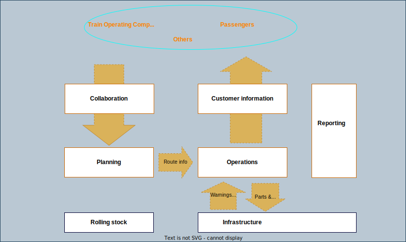

# Domain Driven

With a domain driven approach to our overall information architecture we able to focus on event based information expressing what we do and share real time data with other systems and external parties through our integration platform. 

Our strategy emphasizes on developing our information architecture in a way that provides business value internally and to external business partners.  

| **Domains**
|------------------------------|
|             

**Information**

Event based information planned to be shared through our integration platform. 

| **Capacity**          | **Route**      | **Alarms**   | **Logistics**     | **Passenger** | **Train**      |
|-----------------------|----------------|--------------|-------------------|---------------|----------------|
| capacity request      | Train position | Train alarms | Material Delivery | Availability  | Train material |
| Capacity update       |                |              | Material receipt  | Measures      |                |
| Capacity cancellation |                |              | Material return   |               |                |
|                       |                |              |                   |               |                |
|                       |                |              |                   |               |                |