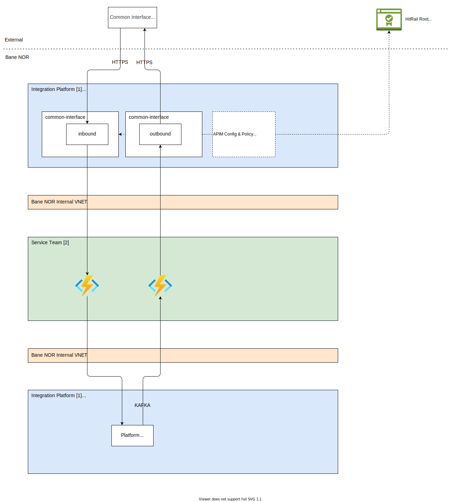

# HitRail Common Interface

Common Interface is an external system that needs to be integrated towards Bane NOR's internal systems. This is an system that do not follow the newer modern style of integrating so we need to add some specific change for this solution.

!!! warning
    This will not be a widely supported solution as this is to get one specific use case working. Not all guidelines can be followed from the 3rd party vendor.

## Security Configuration

The following sections describes the needed security mechanisms needed to support the Common Interface from HitRail.

APIM Configuration's will mainly be made up of:

- Verify certificate
- Restrict Caller IP's

Figure 1 shows an overview of the components involved in this solution

!!! note
    This overview do not visualize every component in the architecture only the ones involved for data flow from Common Interface in `Azure`.

!!! info
    Integration Team only manage the APIM and Kafka components. The relevant _service team_ needs to own and manage the other components. Tough Integration Team will support on connecting the parts together.

{width="900"}

- [1] Managed by the Integration Team
- [2] Managed by the individual service teams

### Certificate

In this solution an `Azure Key Vault` will be used for storing the certificate signed by HitRail. This certificate stored in the _key vault_ can then be accessed by the APIM to be used in an policy. This will give the responsible _service team_ the possibility to update certificates without involving the integration team.

The service team has the responsibility to mange the certificate and renew it when it's needed. This can be managed from the `Azure Key Vault` by following Microsoft's procedure to create [signing requests](https://learn.microsoft.com/en-us/azure/key-vault/certificates/create-certificate-signing-request?tabs=azure-portal#add-certificates-in-key-vault-issued-by-non-partnered-cas) which needs to be sent to HitRail.

Integration Team will then add the connection between the APIM and `Azure Key Vault` so that the certificate can be used in the [policy](https://learn.microsoft.com/en-us/azure/api-management/api-management-authentication-policies#ClientCertificate) added to the `API` or `product` depending on if its used specifically for one API or should be used for many API's.

### IP Filtering

Another policy that will be added to the APIM `product` for HitRail API's is the [Restrict Caller IP's](https://learn.microsoft.com/en-us/azure/api-management/api-management-access-restriction-policies#RestrictCallerIPs).

This is to ensure that only HitRail's services are able to send changes to the Bane NOR API endpoints on those specific API's.

!!! warning
    Integration Team will not follow up on IP changes. This needs to be done by the _service team_ responsible for the solution. If additional IP addresses or changes are to be done report those to the integration team for policy changes.
