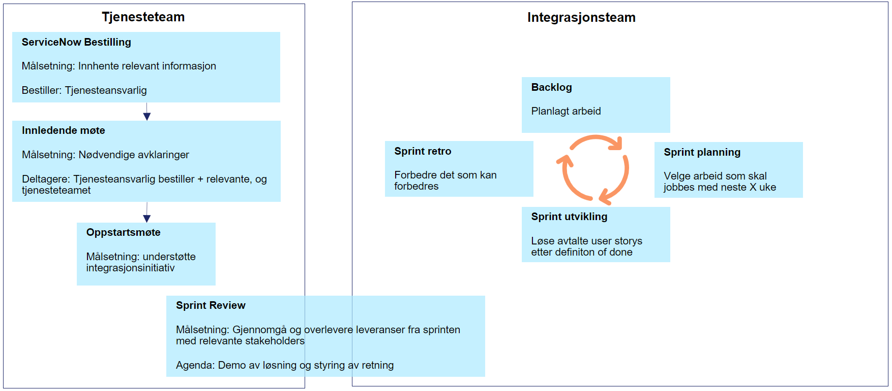

# Requirements for enrolling in API ManagementManagement

Bane NOR's software is moving towards a decoupled microservice oriented architecture. The main part of going towards this is by using Event Driven Architecture with support for RESTful APIs. We have different service teams that own, deploy and operate these services. API Management ([Azure API Management](https://azure.microsoft.com/en-us/products/api-management/#documentation)) will help to transition towards the decoupled microservice oriented architecture.

The following guidelines describes hard and soft requirements for enrolling in API Management so that service responsible and service teams are enable to work autonomous, and deliver value to Bane NOR and Bane NOR's customers.

!!! note "Intended Audience" 
    - `Service Owners`
    - `Project Managers`
    - `Architects`

## Conventions used in these guidelines

The requirement level keywords "MUST", "MUST NOT", "REQUIRED", "SHALL", "SHALL NOT", "SHOULD", "SHOULD NOT", "RECOMMENDED", "MAY", and "OPTIONAL" used in this document (case insensitive) are to be interpreted as described in [RFC 2119](https://www.ietf.org/rfc/rfc2119.txt).

## Table of Contents

This document contains the following:

- [General](#general)
- [API Management Audience](#api-management-audience)

## General

These are general guidelines the different `service teams` and `service owners` needs to be aware of.

### SHOULD comply with Bane NOR IKT-principles

It is crucial to follow general guidelines from Bane NOR, therefore reading and fully understanding Bane NOR's IKT-principles is a prerequisite before enrolling in API Management. The principles are provided by _IKT Virksomhetsarkitektur_ in Bane NOR and can be found here: [Bane NOR IKT principles](https://banenor.sharepoint.com/:b:/t/DT_IKTIntegrasjoneroganalyse/EeiCi6G5CvdMv0TJBMIbGXUBKuxyqwbnZNidQsNllFh7WA).

### MUST be coordinated with service owners within their respective domains

Initiatives that wants to enroll in API Management need to have acceptance from their service owners to ensure coordination of initiatives.

### MUST understand shared responsibilities with API Management

Enrolling in API Management means that service teams need to configure and support part of the implemented solution. In other words, there is a shared responsibility between those responsible for the API products (usually the service teams that creates them) and API Management is available for the service teams.

### SHOULD understand the value API Management provides

Service teams needs to understand how API Management provides value so that service teams can achieve their goals.

- The stakeholder of service teams **should** know why and how enrolling in API Management is beneficial.
- If service teams already hosts some APIs they need to understand how moving them to API Management affects their current products.
- Consuming a managed service means responsible for staying up-to-date on API Management changes affecting environments of service teams.
- `Integration Team` has no control over the individual service teams backend services, this means that the `service teams` **should** monitor and support their API's all the way from customer to their backends.

### SHOULD familiarize themselves with technical guidelines to ensure compliance

To have an overview of the technicalities, the service teams **should** study the technical requirements before enrolling in API Management. Please refer to [Integration guidelines](../../guidelines/integration.md).

### MUST know if my system is in the Cloud (including SolidCloud) or On-Prem

API Management is available in Cloud. This means initiatives that are On-Prem will not be able to use API Management directly. If On-prem solutions needs to be used from external parties own API's needs to be created in the Cloud that uses event driven to send and receive data from on-prem systems.

### MAY attend Bane NOR workshop for using API Management

Service teams **may** attend technical introductory workshops given by the Integration team. This workshops explains how to use API Management, including:

- Rules when creating APIs in API Management so that ideally, all Bane NOR API's will appear as if the same author created them.
- How to perform actions in API Management
- Where to contact if something is wrong

## API Management Audience

<!--TODO: Rewrite so we don't mix in API Management Products -->

API Management serves as mediation layer over the backend APIs. Frontend API is an API that is exposed to API consumers from API Management. You can customize the shape and behavior of a frontend API in API Management without making changes to the backend API(s) that it represents. Sometimes frontend APIs are referred to simply as APIs. APIs can be located in multiple products.

A _product_ is a bundle of frontend APIs that can be made available to a specified group of API consumers for self-service onboarding under a single access credential and a set of usage limits.

### MUST know whom your audience are

Must know API Audience so that the APIs are made available for the correct audience(s). Please refer to API Audience groups as specified in the [Quickstart](../../quick-start.md#api-audience).

### MUST make sure your APIs is made available in a unified way

Bane NOR is naming their APIs in an domain centric way. This means that `service owners` and the `service teams` needs to be aware in what domain their specific API's belongs to. See [Naming conventions](../../guidelines/naming.md) for more information.

### MUST have the following information for name and ownership of API

Information needed as seen in the table:

| Description         | Parameter type | Example value               | Notes                                                                                      |
| ------------------- | -------------- | --------------------------- | ------------------------------------------------------------------------------------------ |
| Displayname         | string         | "Realtime Plan"             | This is the name that will be seen in the developer portal                                 |
| API path            | string         | "customer-info/realtime"    | Suffix for API URL according to [naming standard](../../guidelines/naming.md)              |
| API Version         | string         | "v1"                        | The version of the API default to "v1" if it is the first version                          |
| User Principal Name | string         | "jeff.snow@coolcompany.com" | The owner of the API resource in API Management, this owner can give access to other users as needed |

---

## Process for enrolling in API Management

