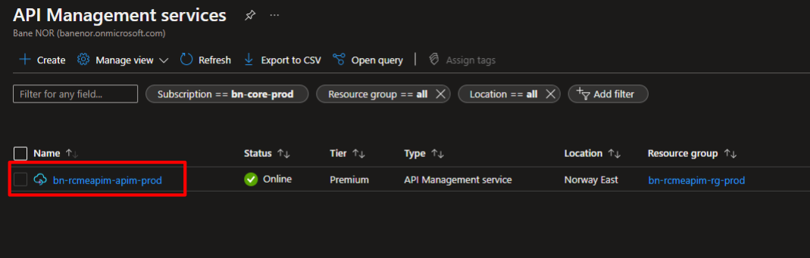
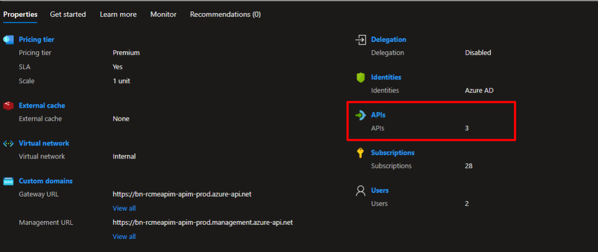
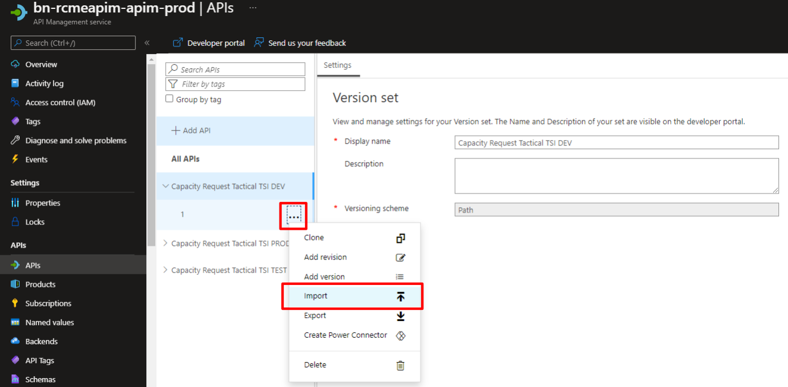
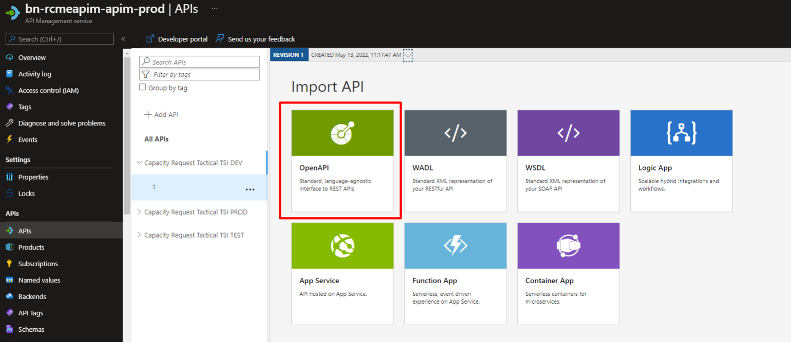
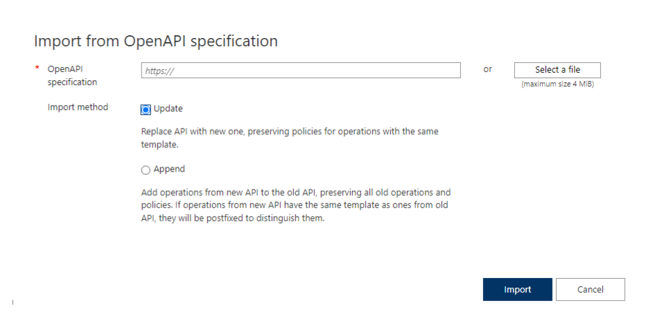

# Add OpenAPI Specification

In Bane NOR we standardizing on using Open API specification for detailing out the REST APIs. Azure API Management (APIM) has added ways to add this specification in different ways that will be shown here.

Before this can be done the Integration Team needs to have created and configured an API shell for use by the team responsible for the API to be exposed.

## Import an OpenAPI specification

1. Go to the APIM instance in the Azure Portal.

    

2. Select APIs on the Overview page or from the menu on the right or in the menu on the left side.

    

3. Click ... next to the API that you want to append another API to.

4. Select Import from the drop-down menu.

    

5. Select OpenAPI from which to import an API.

    

6. In the import menu add the needed configuration.
    - Get OpenAPI specification from a file or URL
    - Update or Append the new specification to the API

    

## References & useful links

- [Import Open API Specification (Microsoft)](https://docs.microsoft.com/en-us/azure/api-management/import-api-from-oas)
- [APIM Import Restrictions (Microsoft)](https://docs.microsoft.com/en-us/azure/api-management/api-management-api-import-restrictions)
