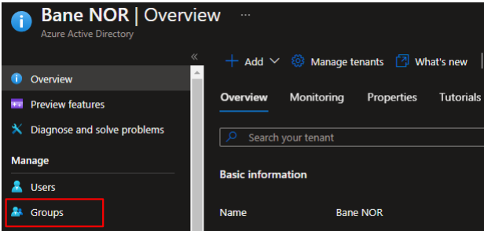
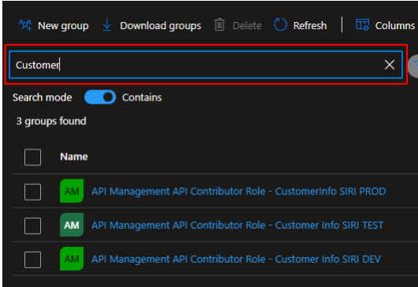
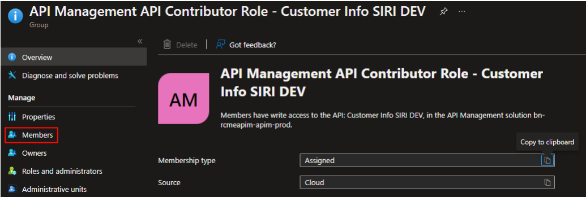
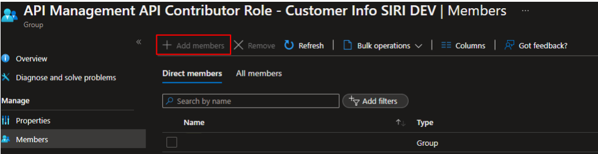

# Manage API Access Groups

Developers need access to manage the API's they are responsible for in the Azure API Manager portal. All API's have their own dedicated Azure AD group where members can be added. Default there will be an owner of the group that can delegate access after the API has been created.

## Delegate Access to API

By default there is one owner of the access group for the API. The owner can start by delegating access to the API but also give others owner access to the AD group. It is also possible to add an Service Principal where access control can be automated by using DevOps principals.

1. Go to Azure Active Directory (AAD) and go to Groups found in the menu to the left

    

2. Search for the name of the API or if unsure search for the main group where all API groups are collected to named bn-rcmeapimreader-adg-prod

    

3. Open up the group and go to the Members section to add new users or service principals. If the collection group bn-rcmeapimreader-adg-prod find the correct group to add members to

    

4. Press the Add members and add the needed users and/or service principals

    
