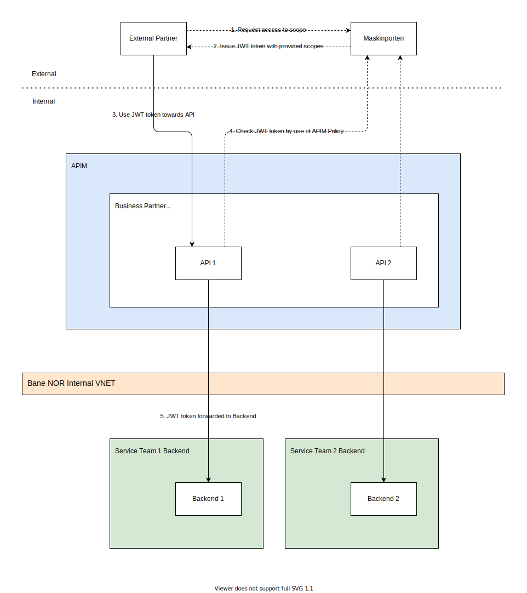
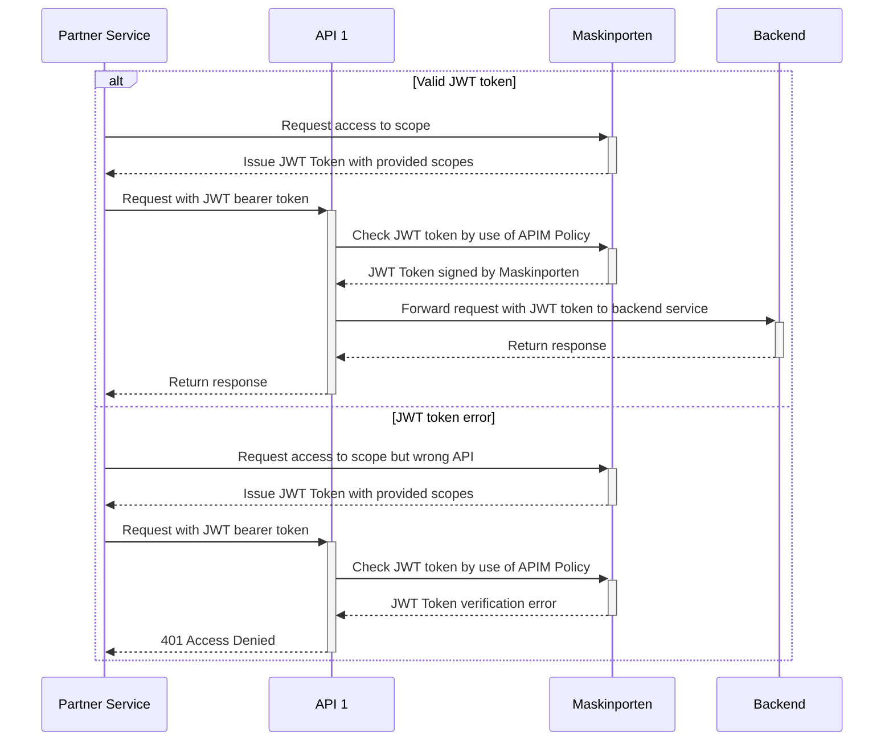

# Maskinporten

[Maskinporten](https://samarbeid.digdir.no/maskinporten/maskinporten/25) is a product from [digidir](https://www.digdir.no/) which is part of the Norwegian [Digitalisation Agency](https://www.digdir.no/digdir/about-norwegian-digitalisation-agency/887).

By using Maskinporten companies can have a common platform to do authentication and authorization cross companies for sharing data.

Some reasons to pick Maskinporten are:

- A company do not need to develop their own security mechanisms to control sharing of data securely with external partners.
- By using Maskinporten governmental and private companies can be sure that they communicate and share data with those they trust.
- Self service solution witch makes it easier to control access cross companies.

More information go to [This is Maskinporten (norwegian)](https://samarbeid.digdir.no/maskinporten/dette-er-maskinporten/96) and for [statistics](https://samarbeid.digdir.no/maskinporten/maskinporten/995) of the usage.

## Business Partners

Bane NOR will have business partners that will communicate thru APIs. Maskinporten will help with self service support between the business partners to gain access to APIs. For more information around self service see [documentation](https://docs.digdir.no/docs/Maskinporten/maskinporten_sjolvbetjening_web.html) from digidir in Norwegian.

This helps with controlling the integrity of the incoming requests or access to data for specific partners.

## Maskinporten & APIM

To be able to control incoming requests to Bane NOR APIs there will be implemented some standard policies that will be used to control the access to those APIs. `Integration Team` will standardize how this will be implemented on APIs with an audience of [`business-partner`](../../guidelines/integration.md).

{width="700"}

The JWT token flow of the image above with a successfull scenario and an error scenario.

