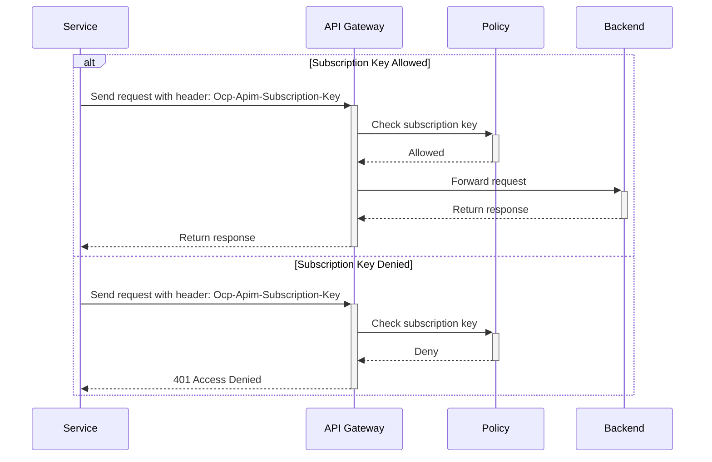
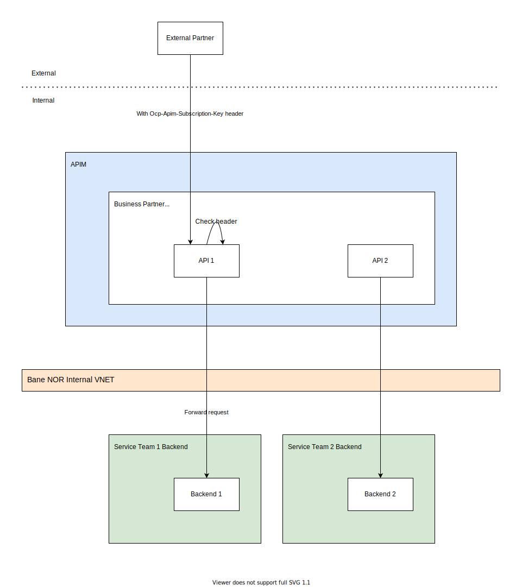

# Subscription Key

The `API Management` (APIM) supports the usage of *subscription keys* which gives an easy self service support to use APIs. Developers who need to consume the published APIs must include a valid subscription key in HTTP requests when calling those APIs. Without a valid subscription key, the calls are:

- Rejected immediately by the API Management gateway.
- Not forwarded to the back-end services.

To access APIs, developers need a subscription and a subscription key. A *subscription* is a named container for a pair of subscription keys.

In addition,

- Developers can get subscriptions without needing approval from API publishers.

## Developer Account

Developers needs an account in Bane NOR [Developer Portal](https://api-portal.banenor.no/) to be able to generate subscription keys. For information on how to create an account go to [TBD](overview.md).

### Manage subscription keys

Regularly regenerating keys is a common security precaution. Like most Azure services requiring a subscription key, API Management generates keys in pairs. Each application using the service can switch from key A to key B and regenerate key A with minimal disruption, and vice versa.

## Subscription keys

When the subscription key pair has been generated by the developer it needs to be configured for use. All requests towards the `API Gateway` needs the header value `Ocp-Apim-Subscription-Key` with the key generated in the portal:

```text
GET /customer-info/realtime/v1/es HTTP/1.1
Host: api.banenor.no
Accept: application/xml;
Accept-Encoding: gzip,deflate
Ocp-Apim-Subscription-Key: 264a41411c0b43e782f483eb6f3eaeab
```

!!! note
    API Management doesn't provide built-in features to manage the lifecycle of subscription keys, such as setting expiration dates or automatically rotating keys.



{width="700"}
