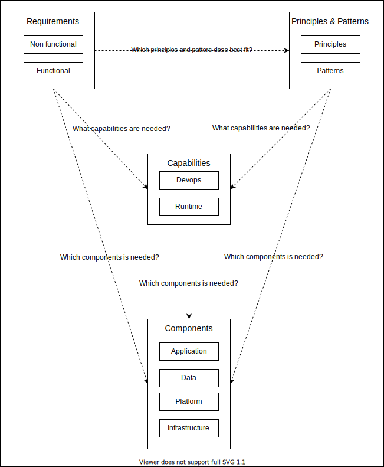

# Architecture

!!! warning "Under Construction"
    This page is under construction and will be filled with more information at a later time.

Bane NOR Integration Platform is an set of common components that has been decided out from certain capabilities and requirements. This documentation describes these choices that affects the defined capabilities and the components that provides them.

## Requirements

Functional and non-functional requirements for the Integration Platform has been important to shape the architecture.

They are important input to deciding which capabilities required and they also is important input to the Architecture Principles and Architecture Patterns.

### Functional

Functional requirements can be important to the architecture decisions.

!!! info "TODO"
    Add in requirements

### Non-Functional

Non functional requirements contains requirements that typically is important for deciding the architecture.

!!! info "TODO"
    Add in requirements

## Integration & Data Transport Capabilities

- End-point Enablement for services and APIs
- Transport & Delivery for data and messages

### End-point enablement

Application created might have an need to enable communications thru APIs.

### Publish & Subscribe

As part of the integration platform is to create an Events component that services can publish their events and other can subscribe to.

This is in detailed explained under [Events capabilities](#event-capabilities).

### Transport & Delivery

The different solutions of the platform support transport & delivery of the data.

By default the services are the active parts for transporting data. Business Partners needs to events to Bane NOR for order capacity, and need to pull data to receive events.

## Event capabilities

Description of the event capabilities for Bane NOR.

Bane NOR is moving to an [event-driven architecture](https://en.wikipedia.org/wiki/Event-driven_architecture). In this context, this means that applications (services) running in Bane NOR will publish events that internal and external and parties (citizens and businesses) can subscribe to and react to.

### Overall Concept

In Bane NOR there will be different services deployed that needs to integrate with other services. These services will be accessed by internal, partners or public services.

The event architecture would make it possible to get notified when there are events in the platform related to data that the different actors have an interest in. It could be anything from partners requesting rail roads to citizens needing to find out what time something is planned to go.

### Events

Events would be a combination of standard events defined by the platform and custom events added in an application by application developers.

The events will typically only contain information about that an event has happened with a reference to some data that was changed because of that event.

### Event Attributes

Events would typically have some attributes used for filtering, routing or identification of a specific event

### Event Producers

!!! note "TODO"
    Add information about producers

### Event Consumers

#### Internal

Bane NOR has internal services that needs to consume integration events from other services.

#### Partners

Bane NOR has business partners that need to subscribe to events happing at Bane NOR to be able to understand what is available for partners.

#### Citizens

Bane NOR has an `Open Data Policy` which means that citizens **must** be able to subscribe and get data from Bane NOR services.
