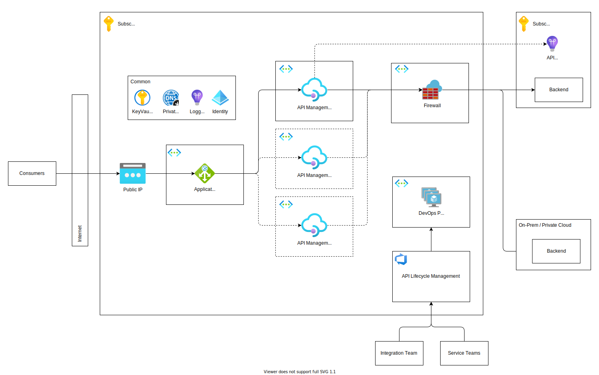
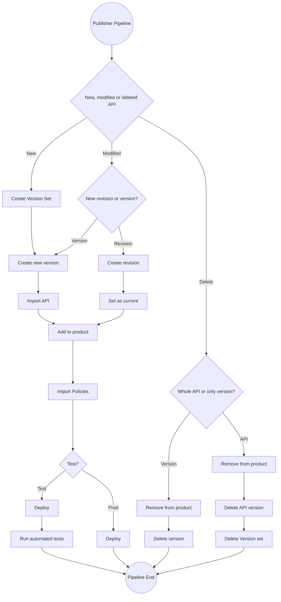
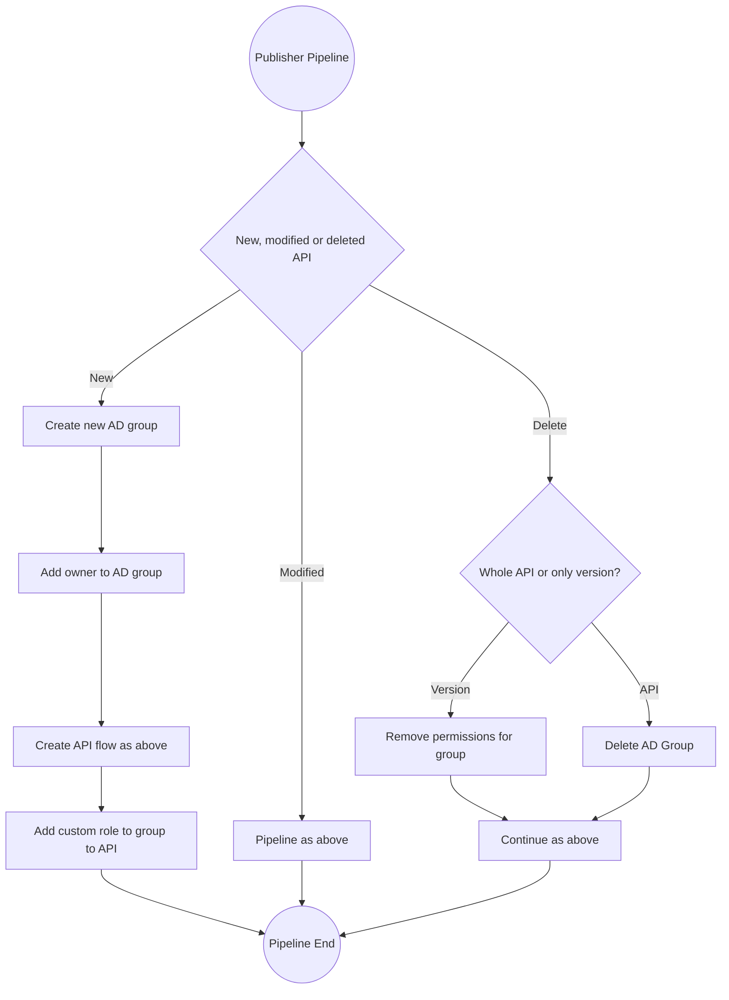

# API Lifecycle Management

|            |            |
| ---------- | ---------- |
| **Status** | Proposed   |
| **Date**   | 2022-11-08 |

---

## Proposed Design

Bane NOR will have individual teams that need to develop and deploy API thru an API Management. We will here propose a way of supporting this based on some of Microsoft's documentations and adjusted according to Bane NOR needs:

- [API Management Automation](https://learn.microsoft.com/en-us/azure/cloud-adoption-framework/scenarios/app-platform/api-management/platform-automation-and-devops)
- [API Management Architecture](https://learn.microsoft.com/en-us/azure/architecture/example-scenario/integration/app-gateway-internal-api-management-function)

All automation will be done by using Terraform for IaC.

### Basic Concepts

API deployments to production **must** be automated. Some control points for specific changes should be added to ensure quality of the specifications and APIs that are built and exposed thru the API Management.

API Lifecycle Management places the API Management infrastructure under version control to achieve these goals. Rather than making changes directly in the production API Management, operations happen through code changes that will be reviewed and audited.

In this section we provide with an architecture diagram for the *API Lifecycle Management* architecture. We recommend you take the time and understand the following concepts:

- API Lifecycle Management applies the concepts of GitOps and DevOps to API deployment. By using practices from these two methodologies, this can enable everyone involved in the lifecycle of API design, development, and deployment with self-service and automated tools to ensure the quality of the specifications and APIs that they’re building.
- API Lifecycle Management places the Azure API Management infrastructure under version control to achieve these goals. Rather than making changes directly in API Management, most operations happen through code changes that can be reviewed and audited. This approach supports the security principle of least-privilege access.
- API Lifecycle Management not only enforces policies within API Management, but also helps support security by providing feedback for proposed policy changes. Early feedback is more convenient for developers and reduces risks and costs. Also, the earlier in the pipeline that you can identify deviations from your standards, the faster you can resolve them.
- Also, the more APIs that you build and deploy by following this approach, the greater the consistency between APIs. With greater consistency, it’s less likely that the service can’t or won’t be consumed because of low quality.


??? example "Example: shared git repository"
    Possible to use forking of the shared repository so each team can work separately and then create a PR to the Integration Team controlled repository to deploy to production. This means that Service Teams and Integration Team should be in the save DevOps Organization.

    ```text title="Shared Repository Structure"
    api/  -- Different teams can configure their APIs in feature branches and create PR to main branch
        domain/  -- Different Bane NOR domains are separated into folders with their APIs
            api1/
                api.json/yaml
                policy.xml
                config.json/yaml
                specification.yaml/json
            api2/
                api.json/yaml
                policy.xml
                config.json/yaml
                specification.yaml/json
    products/
        external/  --  Products available to external partners
            Public/
                config.yaml/json
                policy.xml
            BusinessPartners/
                config.yaml/json
                policy.xml
        internal/  --  Products available only internally to Bane NOR
            domain1/
                config.yaml/json
                policy.xml
            domain2/
                config.yaml/json
                policy.xml
        ...
    .gitignore
    README.md
    ...
    ```

### Supporting Scenarios

In this section we discuss the different scenarios that the API Lifecycle Management tool supports. The first scenario addresses the needs of users who build their APIs via code utilizing an IDE (e.g. VS Code). The second scenario **may** be addressed by giving users access to the dev portal to build their APIs from the Azure portal.

#### Scenario A: Users Who Build APIs Using an IDE

In this scenario the Integration Team and developers of the APIM instance prefer a code first approach.

In this scenario you don’t need to utilize the extractor tool to generate the artifacts as the artifacts will be created in the IDE.

#### Scenario B: Users Who Build APIs Using the Azure Portal

In this scenario the Integration Team and developers of the APIM instance prefer to use the Azure portal.

There are couple gotchas that you need to be aware of:

- In this scenario you will utilize the extractor tool to generate the artifacts which will then be promoted across different environments using the publisher tool.
- The provided publisher pipeline publishes the artifacts into the lower environment as well as the higher environments. Wheres republishing to the lower environment may seem repetitive (since the extraction is happening from that environment), this is done to ensure a consistent experience regardless of the scenario. Remember that in Scenario A everything is driven by code which means that you start in the IDE and would need to publish to all environments including the lowest one (e.g. dev environment). Also we felt that republishing to the environment from which you just extracted from serves as an additional guard rail before promoting to higher environments.

### Architectural Overview

This architecture is based on [Microsoft Documentation](https://learn.microsoft.com/en-us/azure/architecture/example-scenario/integration/app-gateway-internal-api-management-function) which is an example of how it could be together with *test* and *dev* instances.



Here we see that *test* and *dev* is on the same public ip but uses different DNS addresses and is controlled by the same firewall towards the internal network. All automation of the API Management instances will be done thru *DevOps pipelines* and *terraform*. The different *service teams* will be able to configure where the logs for the specific API is going to so they can monitor their APIs. 

A possibility is to let the different services teams have their own *dev* instance with [Developer SKU](https://azure.microsoft.com/en-us/pricing/details/api-management/) which gives the different teams control of their own development. Tough the creation of the API Management instances can be controlled from a common repository for audit control. In the shared repository there could be an configuration that could be added per team to create an instance in an controlled way.

Another possibility is to have an shared *dev* instance with access control towards APIs configured for specific teams in the common *repository*. In the *dev* instance service teams has control to configure as will in the portal, but production instance will be locked down to only *pipelines* and the *integration team*. Tough read possibility could be added to service teams if needed.

### Processes

Here are some example processes shown in flowcharts to visualize different scenarios from the mentioned resources above.

Pipelines only shows how it could be with *test* and *prod*, but before we move to test an dev instance would be used first. In this setup and *dev instance* would be created to deploy APIs to as an check and then deleted after before continue to *test* then *prod* environments.

#### Publishing Pipeline

The API Publisher pipeline will do something like the following flowchart for an environment its deploying to. This means that it will go thru an *dev* instance for test deployment before it goes to *production*.



#### Shared Instance

If an instance is shared example as with *dev* instance mentioned above the following extra parts in the process could be added. In this setup and [custom role](https://learn.microsoft.com/en-us/azure/api-management/api-management-role-based-access-control#custom-roles) as mentioned here by Microsoft to controls access to specific APIs.



## Decision

TBD

## Consequences

TBD

## References

- [API Management Automation](https://learn.microsoft.com/en-us/azure/cloud-adoption-framework/scenarios/app-platform/api-management/platform-automation-and-devops)
- [API Management Architecture](https://learn.microsoft.com/en-us/azure/architecture/example-scenario/integration/app-gateway-internal-api-management-function)
- [API Management Pricing](https://azure.microsoft.com/en-us/pricing/details/api-management/)
- [APIOps Cycles](https://www.apiopscycles.com/)
