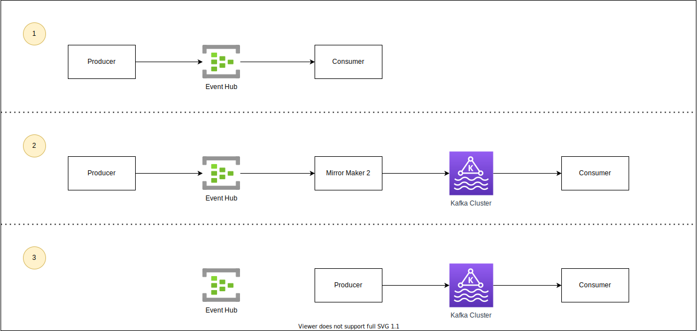
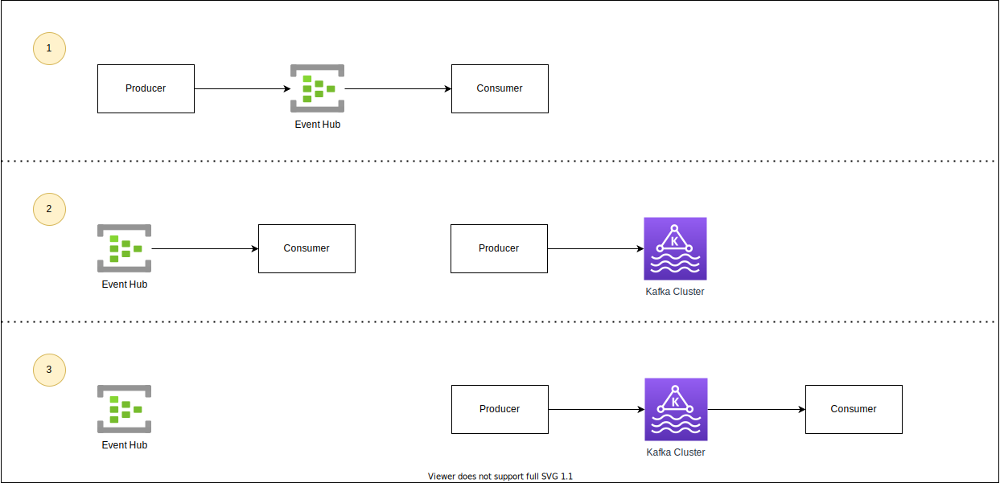

# Azure Event Hub

Since the common capabilities for event driven is not ready there are choices that can be taken to minimize the technical dept when developing the solution.

The closet service existing that can be used for is the `Event Hub` as it supports the `kafka protocol`. The mapping between the two is as following:

| Kafka Concept  | Event Hubs Concept |
| -------------- | ------------------ |
| Cluster        | Namespace          |
| Topic          | An event hub       |
| Partition      | Partition          |
| Consumer Group | Consumer Group     |
| Offset         | Offset             |

This is an service that can be used for development as its mostly an configuration change than rewrite of code depending on libraries are used. And more information can be found at [Microsoft's documentation](https://learn.microsoft.com/en-us/azure/event-hubs/event-hubs-for-kafka-ecosystem-overview).

## Examples

Microsoft has created some turoials/quickstarts for developing towards EventHub with the over the Kafka protocol and can be found [here](https://github.com/Azure/azure-event-hubs-for-kafka).

## Migrations

If there would be scenarios where we need to migrate existing data from the Event Hub to the Kafka cluster a component called `Mirror Maker 2` can be used to move synchronize them.

As seen in the figures where we can have different scenarios for migrations

### Synchronize data while moving consumer(s) and producer(s)

1. `Producer(s)` sends events to an Event Hub where `Consumer(s)` are subscribing to for events.
2. Reconfigure the `Consumer(s)` to receive data from the kafka cluster and start an `Mirror Maker 2` to synchronize the Event Hub to an kafka topic.
3. Stop the `Producer(s)` to send message to the event hub an reconfigure to send to Kafka. Here we could wait until the `Mirror Maker 2` has finished the synchronization and shut it down before starting the `Producer(s)` to send to a new endpoint.

### Move with out Mirror Maker 2

1. `Producer(s)` sends events to an Event Hub where `Consumer(s)` are subscribing to for events.
2. Reconfigure the `Producer(s)` to send new events to the Kafka topic and `Consumer(s)` continues to finish reading up events in the event hub.
3. Wait until `Consumer(s)` has finished reading events from the event hub and reconfigure to get new events from the kafka cluster.

a